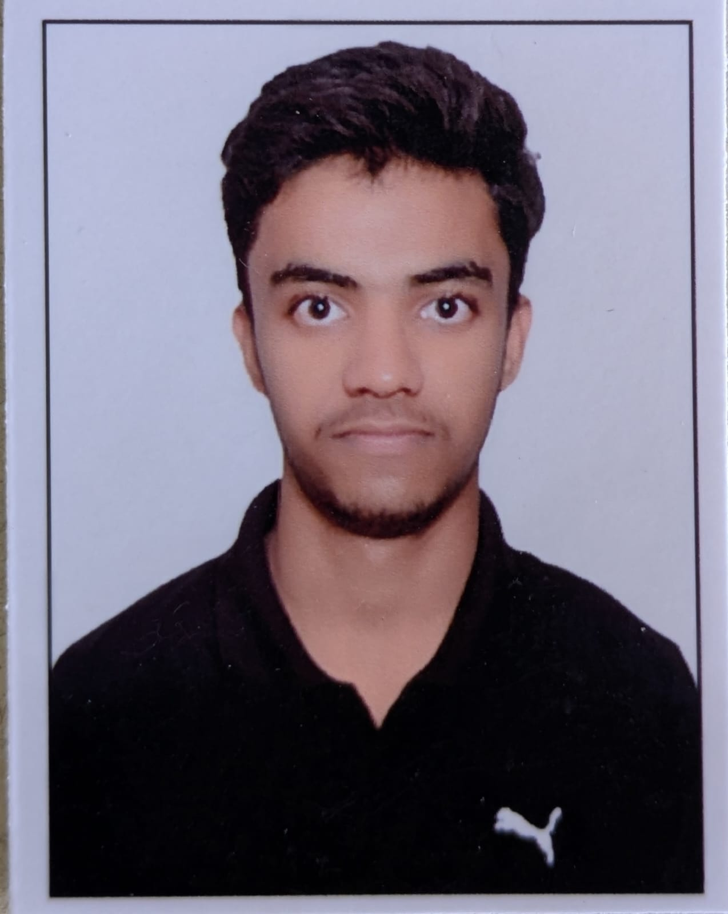

<!DOCTYPE html>
<html lang="en">
<head>
    <meta charset="UTF-8">
    <meta name="viewport" content="width=device-width, initial-scale=1.0">
    <title>MY PORTFOLIO</title>
</head>
<body>

<H1>Dhawal Khatri</H1>
<i> <b>Computer Science Engineering Student</b></i>

 

<h2>About Me</h2>

<ul>
    <li>"I am currently pursuing my Bachelor of Technology (B.Tech) in Computer Science Engineering at SKIT, Jaipur.   I am inclines towards software stuff and newly emerging technologies such as Artificial Intelligence and Machine Learning  Apart from pure core engineering, I am passionate about Aviation and Football."</li>

</ul>

<h2>Education</h2>

<ul>
   <li><b>Bachelor of Technology (B.Tech) - Computer Science Engineering</b> 

<li>Swami Keshvanand Institute of Technology (SKIT), Jaipur</li>
<li>Current Status: 1st Year (2nd Semester)</li>  

<li> <b>Senior Secondary / Class 12th</li></b>

<li>Result: 85%</li>  

<li> <b>Class 11th</li></b>
<li>Result: 91%</li>  

<li> <b>Secondary School / Class 10th</li></b>
<li>Result: 91%</li>    </ul>

<h2>Technical & Soft Skills</h2>

<ul>

    <li>Technical Skills: C, C++, Object-Oriented Programming (OOPs), HTML5,</li>
<li>Soft Skills: Team Contribution , Understanding Problems</li>

</ul>

<h2>Contacts</h2>

    dhawalkhatri1111@gmail.com  
    9649999559    
    Linkdin: <!DOCTYPE html>
 <a href="https://www.linkedin.com/in/dhawal-khatri-557184371/" target="_blank">Linkdin</a>
</head>
<body>
